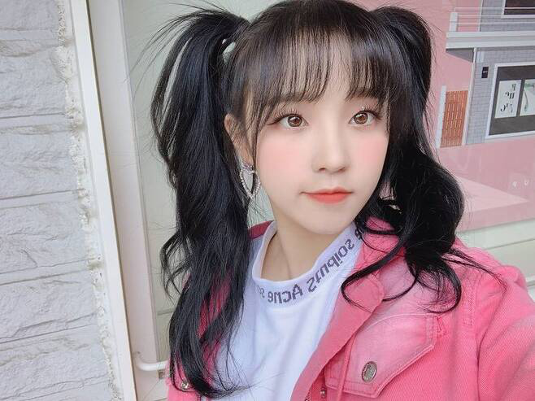
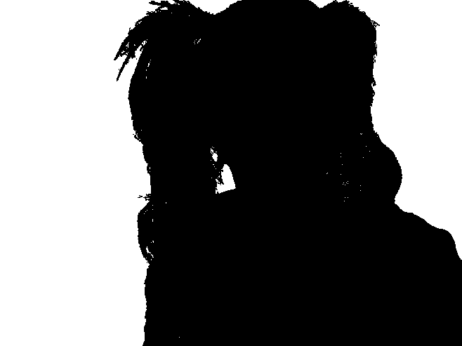

## Text-Driven 3D Motion Portraits

### Environment Setup

This repository environment is based on [Anaconda3](https://www.anaconda.com/products/distribution).

`Method 1`: YML file Installation

```shell
$ conda env create --file environment.yml
```

If the above command not work, try to follow `Method 2`

`Method 2`:  Manual Installation

```shell
$ conda create -n 3DMotion python=3.6

$ pip install tensorflow-gpu==1.15.2
$ conda install pytorch==1.7.1 torchvision==0.8.2 torchaudio==0.7.2 cudatoolkit=10.2 -c pytorch
$ conda install -c fvcore -c iopath -c conda-forge fvcore iopath
$ conda install pytorch3d -c pytorch3d

$ pip install ftfy regex tqdm
$ pip install imageio opencv-python configargparse scipy
$ pip install timm scikit-learn gdown imageio-ffmpeg
$ pip install kornia==0.5.10

$ pip install git+https://github.com/openai/CLIP.git
```

### Download Pretrained Model

To use pretrained [3D-Moments](https://github.com/google-research/3d-moments) implementation, use following command.

```shell
$ cd Moments3D
$ ./download.sh
```

### Stylize + Momentize Demo
```shell
python main.py --content_path demo_images/yuqi.png --mask_path demo_images/mask_yuqi.png --output_path yuqi --text "cherry blossom"
```

### Example Result

#### Content Input Image


#### Mask Input Image


#### Stylized Video (Text: Cherry Blossom)

